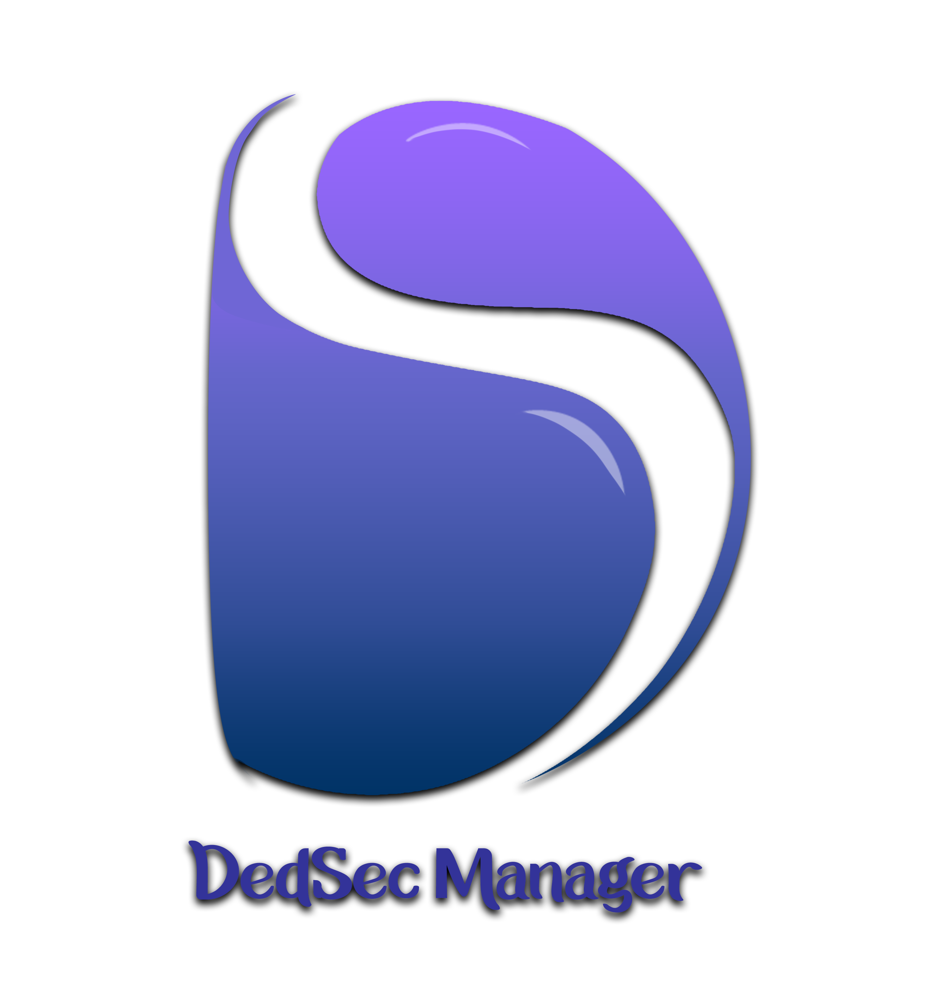

# DS-Manager 

Simple and powerful application to manage accounts and auto report generate

---
### UI Layout

### Sample PDF Report

---

### Contributors
* Mohamed Zumair : [mhdzumair](https://github.com/mhdzumair)
* Pakeetharan Balasupramaniyam : [Pakeetharan](https://github.com/Pakeetharan)
* himasha gunasena : [himashagunasena](https://github.com/himashagunasena)

---
### Licence

      This program is free software: you can redistribute it and/or modify
      it under the terms of the GNU General Public License as published by
      the Free Software Foundation, either version 3 of the License, or
      (at your option) any later version.

      This program is distributed in the hope that it will be useful,
      but WITHOUT ANY WARRANTY; without even the implied warranty of
      MERCHANTABILITY or FITNESS FOR A PARTICULAR PURPOSE.  See the
      GNU General Public License for more details.

      You should have received a copy of the GNU General Public License
      along with this program.  If not, see <https://www.gnu.org/licenses/>.
